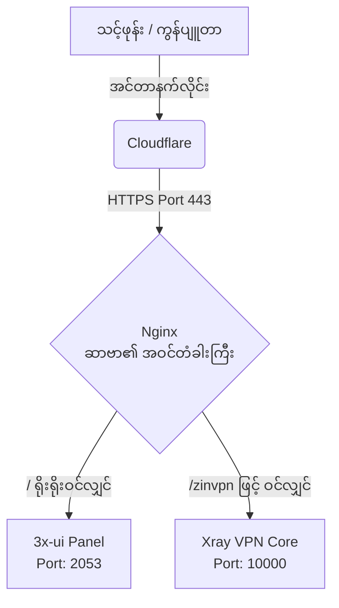

# သင်ခန်းစာ - 3x-ui Nginx Stealth စနစ် မည်သို့ အလုပ်လုပ်သနည်း

ဒီသင်ခန်းစာမှာတော့ ကျွန်တော်တို့ တည်ဆောက်ခဲ့တဲ့ **3x-ui Nginx Stealth Setup** ကြီးရဲ့ နောက်ကွယ်က နည်းပညာတွေ၊ Command တစ်ကြောင်းချင်းစီရဲ့ အဓိပ္ပာယ်တွေနဲ့ လုံခြုံရေး အလုပ်လုပ်ပုံတွေကို အသေးစိတ် လေ့လာသွားကြပါမယ်။

---

## ၁။ လမ်းကြောင်း စီးဆင်းမှုပုံစံ (Traffic Flow)

ပထမဆုံး အနေနဲ့ အင်တာနက် လမ်းကြောင်းတွေ ဘယ်လို သွားသလဲဆိုတာကို အောက်က ပုံလေးနဲ့ အရင် နားလည်အောင် ကြည့်ရအောင်-



ဒီပုံအရဆိုရင် အပြင်ကနေ လာသမျှ လူတိုင်းက ဆာဗာရဲ့ **Port 443 (HTTPS)** ကိုပဲ ဝင်ခွင့်ရပါမယ်။ ဆာဗာထဲက 3x-ui (Port 2053) နဲ့ VPN (Port 10000) တွေကို တိုက်ရိုက် လှမ်းချိတ်လို့ မရအောင် Nginx က အရှေ့ကနေ ခံပြီး ကာကွယ်ပေးထားတာ ဖြစ်ပါတယ်။ ဒါကို **Reverse Proxy** လို့ ခေါ်ပါတယ်။

---

## ၂။ Nginx ကို ဘာလို့ သုံးရတာလဲ? (The Shield)

```nginx
server {
    listen 80;
    server_name sgvless.yourdomain.com; 
    
    location / {
        proxy_pass http://127.0.0.1:2053;
        ...
```

**ရှင်းလင်းချက်:**
* 3x-ui Panel ကို တိုက်ရိုက်ဖွင့်ထားရင် (ဥပမာ `http://IP:2053`) ISP တွေ (MPT, ATOM) နဲ့ Hacker တွေက "ဒါ VPN ဆာဗာပဲ" ဆိုတာ အလွယ်တကူ သိနိုင်ပါတယ်။
* ဒါကြောင့် Nginx ဆိုတဲ့ Web Server ကို ကြားခံထားလိုက်ပါတယ်။ အပြင်က ကြည့်ရင် ရိုးရိုး Website တစ်ခု (Port 80/443) အနေနဲ့ပဲ မြင်ရမှာ ဖြစ်ပြီး၊ Nginx ကမှတစ်ဆင့် ဆာဗာ အတွင်းပိုင်းက Port `2053` ဆီကို လျှို့ဝှက်စွာ လမ်းကြောင်းလွှဲ (`proxy_pass`) ပေးတာ ဖြစ်ပါတယ်။

> [!TIP]
> Nginx သုံးလိုက်တဲ့အတွက် **Cloudflare ရဲ့ CDN (အဝါရောင်တိမ်တိုက်)** ကိုပါ အသုံးပြုနိုင်သွားပြီး၊ သင့်ဆာဗာရဲ့ IP အစစ်ကို ၁၀၀% ဖျောက်ထားနိုင်သွားပါတယ်။

---

## ၃။ SQLite Commands တွေက ဘာလုပ်တာလဲ? (The Backend Hack)

Setup Guide မှာ သင် ကိုယ်တိုင် ရိုက်ခဲ့တဲ့ အောက်ပါ Command တွေကို မှတ်မိဦးမှာပါ-
```bash
sudo sqlite3 /etc/x-ui/x-ui.db "UPDATE settings SET value='2053' WHERE key='webPort';"
sudo sqlite3 /etc/x-ui/x-ui.db "UPDATE settings SET value='' WHERE key='webBasePath';"
sudo sqlite3 /etc/x-ui/x-ui.db "UPDATE users SET username='admin', password='admin' WHERE id=1;"
```

**ရှင်းလင်းချက်:**
* 3x-ui ကို အသစ်စသွင်းတဲ့အခါ သူက လုံခြုံရေးအရဆိုပြီး Panel Port တွေကို `57549` လိုမျိုး ရမ်းဘမ်း ပေးထားတတ်ပါတယ်။ 
* အကယ်၍ အဲဒီ Port ကိုသာ မသိခဲ့ရင် Panel ထဲကို လုံးဝ ဝင်လို့ရမှာ မဟုတ်ပါဘူး။ ဒါကြောင့် 3x-ui ရဲ့ Database (`x-ui.db`) ထဲကို **တိုက်ရိုက် ဝင်ပြင်ပြီး** Port ကို `2053` အဖြစ် အတင်းအဓမ္မ ပြောင်းပစ်တာပါ။
* အလားတူပဲ Username နဲ့ Password ကိုလည်း `admin` အဖြစ် ပြန်လည် သတ်မှတ် (Reset) လုပ်လိုက်တာ ဖြစ်ပါတယ်။

---

## ၄။ SSL (Certbot) က ဘာအတွက်လဲ? (The Encryption)

```bash
sudo certbot --nginx -d sgvless.yourdomain.com
```

**ရှင်းလင်းချက်:**
* အင်တာနက် အသုံးပြုတဲ့အခါ သင့်ဖုန်းနဲ့ ဆာဗာကြားက ဒေတာတွေကို ကြားဖြတ် ခိုးယူဖတ်ရှုလို့ မရအောင် (Encryption) သော့ခတ်ပေးဖို့ လိုပါတယ်။ 
* Certbot က Let's Encrypt ဆိုတဲ့ အဖွဲ့အစည်းကနေ အခမဲ့ SSL လက်မှတ် (HTTPS) ကို တောင်းယူပေးပြီး၊ Nginx ထဲကို အလိုအလျောက် ထည့်သွင်းပေးသွားတာ ဖြစ်ပါတယ်။
* ဒီလုံခြုံရေး သော့ခလောက် ရှိမှသာ **VLESS + TLS** စနစ်က အလုပ်လုပ်မှာ ဖြစ်ပါတယ်။

---

## ၅။ VLESS + WS + TLS ဆိုသည်မှာ အဘယ်နည်း? (The Ghost Protocol)

Inbound ဖန်တီးတဲ့အခါ ကျွန်တော်တို့ ရွေးချယ်ခဲ့တဲ့ Setting တွေရဲ့ အဓိပ္ပာယ်တွေက အောက်ပါအတိုင်း ဖြစ်ပါတယ်-

* **VLESS (Protocol):** အရမ်းပေါ့ပါးပြီး အမြန်နှုန်း ကောင်းမွန်တဲ့ နောက်ဆုံးပေါ် VPN စနစ် တစ်ခုပါ။ 
* **WS (WebSocket):** ဖုန်းကနေ ဆာဗာကို VPN လှမ်းချိတ်တဲ့အခါ "ကျွန်တော် VPN ချိတ်တာပါ" လို့ မပြောဘဲ "ကျွန်တော် Website ထဲက Video (သို့) Chat စနစ်ကို သုံးနေတာပါ" လို့ ဟန်ဆောင်လိုက်တဲ့ စနစ် (WebSocket) ဖြစ်ပါတယ်။ ISP တွေက ရိုးရိုး Website ကြည့်နေတယ်လို့ပဲ ထင်သွားပါတယ်။
* **TLS (Transport Layer Security):** စောစောက Certbot ယူထားတဲ့ လုံခြုံရေးစနစ်ပါ။ ဒေတာတွေကို လုံးဝ ဖတ်မရအောင် စာဝှက် (Encrypt) လုပ်ပေးပါတယ်။

> [!NOTE]
> VLESS + WS တွဲသုံးလိုက်တဲ့အတွက် VPN Traffic တွေက Nginx ကို ဖြတ်သွားနိုင်ပြီး၊ Nginx က အဲဒီ Traffic တွေကို Xray (Port 10000) ဆီကို လမ်းကြောင်းလွှဲပေးပါတယ်။ ဒါကို **Websocket Path Routing** လို့ ခေါ်ပါတယ်။

---

## အနှစ်ချုပ်

ဒီစနစ်ကြီး တစ်ခုလုံးရဲ့ အဓိက ရည်ရွယ်ချက်ကတော့ **"သင့်ဆာဗာကို ရိုးရိုး Website တစ်ခုလို ဟန်ဆောင်ထားခြင်း (Stealth)"** ပါပဲ။ 

ISP (အင်တာနက် ဝန်ဆောင်မှုပေးသူ) က ကြည့်ရင် သင့်ဆာဗာက ရိုးရိုး Website လေး တစ်ခုပါပဲ။ 
ဒါပေမယ့် သင့်မှာ မှန်ကန်တဲ့ `vless://` Link လေး ရှိနေမှသာ Nginx ရဲ့ နောက်ကွယ်က တကယ့် VPN (Xray) ဆီကို ဝင်ရောက် ချိတ်ဆက်နိုင်မှာ ဖြစ်ပါတယ်။ ဒါဟာ လက်ရှိ ကမ္ဘာပေါ်မှာ အပိတ်ခံရနိုင်ခြေ အနည်းဆုံးနဲ့ အလုံခြုံဆုံး စနစ်တစ်ခု ဖြစ်ပါတယ်ဗျာ။
